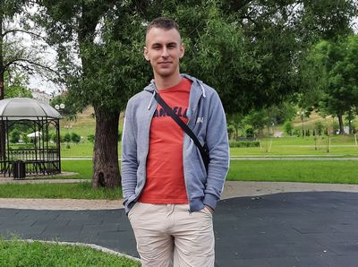

<h1 align="center"> Hi!  I'm Anton.</h1>

<h2 align="center"> About me </h2>

 

My name is Anton Goldovsky.

I am a beginner Front-end developer living in Mogilev, Belarus.
I am motivated to improve my skills and get a job.

- **My skills** : Git, HTML, CSS, JavaScript.

- **Experience** : Front-end courses at the Computer Academy Step.

- **Education** : Mogilev State University of Food Technology.

- **English level** : А2.

---
<h3 align="center"> Contacts </h3>

 
 

  
 <b>Email</b>: anton94-94@list.ru

  
 <b>Phone number</b>: +375(29) 740 64 32.

